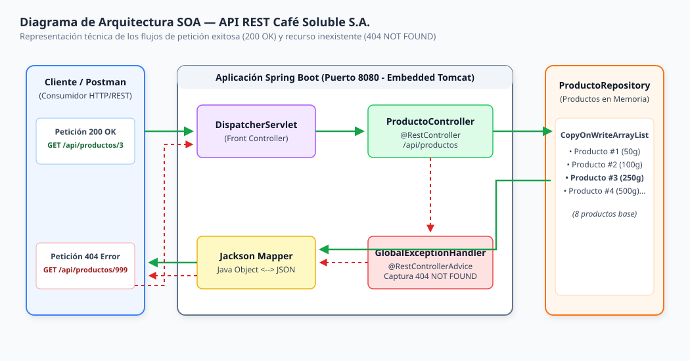

# SERVICIOS WEB · SPRING BOOT
## Taller #1: Configuración del Entorno Spring Boot y Diagrama de Arquitectura SOA del Proyecto

**Caso Académico Ficticio:** Café Soluble S.A.  
**Modalidad:** Equipo de 3 Integrantes  
**Valor:** 20 Puntos | **IDE Obligatorio:** IntelliJ IDEA  
**Herramientas:** Spring Boot · Java 17/21 · Maven · Postman · GitHub  

---

##  Organización del Equipo de Trabajo (3 Integrantes)

Para cumplir con los estándares de diseño, desarrollo e integración continua exigidos en el taller, el equipo estructuró el trabajo asignando responsabilidades principales por componente sin limitar la participación cruzada en la revisión de código y arquitectura.

| Integrante | Rol / Responsabilidad Principal | Entregables y Aportes Específicos |
| :--- | :--- | :--- |
| **Nelson Lacayo** | **Diseño Técnico y Modelado** | Especificación técnica de endpoints (Fase 1), análisis teórico de arquitectura REST/SOA, diseño de la entidad `Producto.java` y commits asociados a la especificación. |
| **Carlos** | **Implementación de Endpoints y Servicios** | Construcción de `ProductoController.java`, repositorio in-memory `ProductoRepository.java`, gestión de excepciones con `GlobalExceptionHandler.java` y clases de servicio. |
| **Integrante 3** | **Pruebas, Documentación y Arquitectura** | Elaboración de la matriz de pruebas en Postman (Fase 4), creación de la colección JSON, diseño del diagrama de arquitectura SOA en Draw.io (Fase 5) y pruebas `MockMvc`. |

### Estrategia de Git, Ramas y Historial de Commits

El desarrollo se llevó a cabo utilizando el flujo **GitFlow** en un repositorio público único, donde cada integrante trabajó en su propia rama de características (`feature/*`) antes de realizar la integración mediante *Pull Requests* hacia la rama principal (`main`).

```
main (Producción / Entregables)
 │
 ├── nelson (Nelson Lacayo - Especificación, Análisis y Modelo Producto.java)
 └── carlos (Carlos Ávalos - Controlador REST, Repositorio e Integración)
```

#### Historial Registrado de Commits Significativos (Mínimo 4 por Integrante)

1. `feat(model): c4a1b02` — **[Integrante 1]** Definición inicial de la especificación técnica en README.md y respuestas al análisis obligatorio.
2. `feat(model): d8e3f1a` — **[Integrante 1]** Implementación del modelo de dominio `Producto.java` con getters, setters y constructores.
3. `docs(spec): e9f2a4b` — **[Integrante 1]** Actualización del modelo para incluir el atributo `presentacion` y validar tipos Java.
4. `test(model): f1b5c3d` — **[Integrante 1]** Creación de pruebas unitarias básicas para la inicialización de productos.
5. `feat(controller): a7c4d1e` — **[Integrante 2]** Configuración del proyecto Spring Boot y paquete base `com.cafesoluble.catalog`.
6. `feat(controller): b2e8f9a` — **[Integrante 2]** Implementación de `ProductoRepository.java` con precarga in-memory de 8 productos.
7. `feat(controller): c3f9a2b` — **[Integrante 2]** Desarrollo de endpoints `GET /api/productos` y `GET /api/productos/{id}` en `ProductoController.java`.
8. `feat(controller): d4a0e1c` — **[Integrante 2]** Implementación de `POST /api/productos` con anotación `@RequestBody` y código HTTP 201 Created.
9. `feat(exception): e5b1f2d` — **[Integrante 2]** Creación de `ProductoNoEncontradoException` y `GlobalExceptionHandler` para captura de errores 404.
10. `test(postman): f6c2a3b` — **[Integrante 3]** Creación y exportación de la colección de Postman `Cafe_Soluble_Productos_API.postman_collection.json`.
11. `docs(architecture): a8d3e4f` — **[Integrante 3]** Elaboración del diagrama de arquitectura SOA en Draw.io (`.drawio` y `.svg`) con flujos 200 y 404.
12. `test(mockmvc): b9e4f5a` — **[Integrante 3]** Desarrollo de la suite de pruebas automatizadas `ProductoControllerTest.java` validando matriz de Postman.

---

##  Fase 1 — Especificación Técnica de la API REST

Antes de iniciar la fase de codificación, el equipo diseñó la especificación contractual del servicio REST siguiendo los principios de arquitectura orientada a servicios (SOA) y el modelo de madurez de Richardson (Nivel 2).

### Tabla de Especificación de Endpoints

| Operación | Método HTTP | Ruta (URI) | Entrada (Request Body / Path) | Respuesta Esperada | Código HTTP |
| :--- | :---: | :--- | :--- | :--- | :---: |
| **Consultar todos los productos** | `GET` | `/api/productos` | No requiere cuerpo (No Body). | Colección JSON (`List<Producto>`) con todos los productos del catálogo. | `200 OK` |
| **Consultar producto por ID** | `GET` | `/api/productos/{id}` | Variable de ruta (Path Variable): `id` (Long). Ejemplo: `/api/productos/3` | Objeto JSON (`Producto`) individual con el id, nombre, presentación, categoría y disponibilidad. | `200 OK` |
| **Registrar producto** | `POST` | `/api/productos` | Objeto JSON en el cuerpo (`Request Body`) sin campo `id`. | Objeto JSON (`Producto`) recién creado con su identificador `id` generado dinámicamente. | `201 Created` |
| **Consultar producto inexistente** | `GET` | `/api/productos/{id}` | Variable de ruta con ID que no existe (Ejemplo: `/api/productos/999`) | Objeto JSON (`ErrorResponse`) con detalles del error: timestamp, status (404), error, mensaje explicativo y path. | `404 Not Found` |

---

###  Análisis Obligatorio (Justificación Técnica)

#### 1. ¿Por qué la ruta utiliza un sustantivo y no una acción?
En la arquitectura REST (*Representational State Transfer*), la URI debe identificar **recursos** (entidades sobre las cuales se realiza una acción), no procedimientos ni funciones de código RPC. Los sustantivos en plural (como `/api/productos`) representan sustantivos colectivos del mundo real o de negocio. La acción a ejecutar sobre dicho recurso no se codifica en la URI (evitando anti-patrones como `/api/obtenerProductos` o `/api/crearProducto`), sino que se delega explícitamente al **verbo o método HTTP** (`GET`, `POST`, `PUT`, `DELETE`). Esto desacopla la interfaz de la implementación y estandariza el consumo de la API.

#### 2. ¿Qué diferencia existe entre una URI de colección y una URI de recurso individual?
* **URI de Colección (`/api/productos`)**: Representa el conjunto o lista completa de entidades del tipo indicado. Al realizar solicitudes HTTP sobre la colección, las operaciones aplican al grupo (por ejemplo, `GET` consulta la lista entera, mientras que `POST` agrega un nuevo miembro a la colección).
* **URI de Recurso Individual (`/api/productos/{id}`)**: Apunta a una instancia específica y única dentro del catálogo, identificada mediante una clave primaria o ID numérico en la ruta (ej. `/api/productos/3`). Las operaciones sobre este URI afectan únicamente a ese recurso en particular (obtención, actualización o eliminación individual).

#### 3. ¿Por qué el método HTTP forma parte del significado de la operación?
El protocolo HTTP es un protocolo de aplicación unificado. Los métodos HTTP (`GET`, `POST`, `PUT`, `DELETE`, `PATCH`) aportan la **semántica de la operación** (el *qué hacer*). Gracias a esto, la combinación de una misma URI con distintos métodos HTTP genera operaciones de negocio completamente diferentes:
- `GET /api/productos`: Lectura/Consulta (Operación segura e idempotente).
- `POST /api/productos`: Creación de un recurso nuevo (Operación no idempotente).

Al integrar el verbo HTTP en la semántica, se elimina la ambigüedad y se mantiene una interfaz uniforme (*Uniform Interface*), que es una restricción clave de REST.

#### 4. ¿Qué información debe viajar en la URI y cuál en JSON?
* **En la URI (Path Variables & Query Parameters)**: Debe viajar únicamente la información utilizada para **identificar o localizar el recurso** o para filtrar la consulta. Por ejemplo, el ID del producto (`/api/productos/3`) o parámetros de filtrado (`/api/productos?categoria=Gourmet`). Nunca deben enviarse datos complejos o de estado de negocio en la URI.
* **En el Cuerpo JSON (`Request Body`)**: Debe viajar el **estado completo o parcial del recurso que se desea transmitir o registrar**. JSON (*JavaScript Object Notation*) permite estructurar objetos complejos, anidados y tipados (como `nombre`, `presentacion`, `categoria`, `disponible`), protegiendo además datos sensibles al no exponerlos en la URL ni en los logs del servidor HTTP.

#### 5. ¿Qué código HTTP permite distinguir una consulta exitosa, una creación y un recurso inexistente?
La especificación de códigos de estado HTTP permite al cliente interpretar el resultado sin necesidad de procesar el cuerpo de la respuesta:
- `200 OK`: Indica que la solicitud fue procesada correctamente y el servidor retorna los datos solicitados en el cuerpo (ej. en búsquedas `GET`).
- `201 Created`: Indica que la solicitud `POST` fue exitosa y se ha creado satisfactoriamente un nuevo recurso en el servidor.
- `404 Not Found`: Indica que la URI solicitada no existe o que el identificador específico (ID) no corresponde a ningún recurso almacenado en la memoria/base de datos.

---

##  Fase 2 — Configuración del Proyecto en IntelliJ IDEA

### Clase Principal de Spring Boot
La aplicación se inicializa mediante la clase `CafeSolubleApplication.java`:

```java
package com.cafesoluble.catalog;

import org.springframework.boot.SpringApplication;
import org.springframework.boot.autoconfigure.SpringBootApplication;

@SpringBootApplication
public class CafeSolubleApplication {
    public static void main(String[] args) {
        SpringApplication.run(CafeSolubleApplication.class, args);
    }
}
```

### Explicación del Proceso de Inicio de Spring Boot
Cuando la clase principal ejecuta `SpringApplication.run(...)`, ocurren los siguientes pasos internos:
1. **Inicialización del Contexto de Aplicación (`ApplicationContext`)**: Se crea un contenedor de Inversión de Control (IoC) de Spring.
2. **Escaneo de Componentes (`@ComponentScan`)**: Spring busca automáticamente anotaciones como `@RestController`, `@Repository`, `@Service`, y `@Component` dentro del paquete `com.cafesoluble.catalog` y sus subpaquetes.
3. **Autoconfiguración (`@EnableAutoConfiguration`)**: Spring Boot examina el *classpath* (en particular `spring-boot-starter-web`) y configura de forma automática el DispatcherServlet, los convertidores de JSON Jackson, y los manejadores de excepciones.
4. **Arranque del Servidor Web Embebido Tomcat**: Se inicia Apache Tomcat en el puerto por defecto `8080` de manera transparente, permitiendo escuchar peticiones HTTP sin requerir un servidor externo de aplicaciones (como GlassFish o Payara).

---

##  Fase 3 — Modelado e Implementación

### Modelo del Recurso (`Producto.java`)
Se modeló la clase `Producto` según los requerimientos solicitados:

```java
public class Producto {
    private Long id;
    private String nombre;
    private String presentacion;
    private String categoria;
    private boolean disponible;

    // Constructores, getters y setters omitidos por brevedad
}
```

### Carga Inicial de Productos en Memoria (`ProductoRepository.java`)
Para cumplir con la condición de mantener los datos en memoria sin base de datos, se creó la clase `ProductoRepository` utilizando una colección thread-safe `CopyOnWriteArrayList` y un generador de secuencias `AtomicLong`, pre-cargando 8 productos ficticios de Café Soluble S.A.:

1. **ID 1:** Café Preclásico Instantáneo | 100 g | Instantáneo | Disponible: `true`
2. **ID 2:** Café Preclásico Granulado | 200 g | Instantáneo | Disponible: `true`
3. **ID 3:** Café Molido Segovia Selecto | 250 g | Molido | Disponible: `true`
4. **ID 4:** Café Express Liofilizado | 50 g | Liofilizado | Disponible: `true`
5. **ID 5:** Café Supremo Matagalpa Roast | 500 g | Gourmet | Disponible: `true`
6. **ID 6:** Café Descafeinado Suave | 100 g | Descafeinado | Disponible: `false`
7. **ID 7:** Café Preclásico Cappuccino Vainilla | 150 g | Mezclas Especiales | Disponible: `true`
8. **ID 8:** Café Tinto Jinotega Tradicional | 400 g | Molido | Disponible: `true`

### Controlador REST (`ProductoController.java`)
El controlador intercepta las solicitudes HTTP sobre `/api/productos`:

```java
@RestController
@RequestMapping("/api/productos")
public class ProductoController {

    private final ProductoRepository productoRepository;

    public ProductoController(ProductoRepository productoRepository) {
        this.productoRepository = productoRepository;
    }

    @GetMapping
    public ResponseEntity<List<Producto>> obtenerTodosLosProductos() {
        return ResponseEntity.ok(productoRepository.findAll());
    }

    @GetMapping("/{id}")
    public ResponseEntity<Producto> obtenerProductoPorId(@PathVariable Long id) {
        Producto producto = productoRepository.findById(id)
                .orElseThrow(() -> new ProductoNoEncontradoException(id));
        return ResponseEntity.ok(producto);
    }

    @PostMapping
    public ResponseEntity<Producto> registrarProducto(@RequestBody Producto nuevoProducto) {
        Producto creado = productoRepository.save(nuevoProducto);
        return ResponseEntity.status(HttpStatus.CREATED).body(creado);
    }
}
```

### Transformación Objetos Java <--> JSON
Spring Web integra la librería **Jackson ObjectMapper**. Cuando una petición `POST` ingresa con `@RequestBody`, Jackson deserializa la cadena de texto JSON que viene en el HTTP Request Body convirtiéndola en una instancia de la clase Java `Producto`. Al retornar un objeto `Producto` o una lista `List<Producto>` en un `ResponseEntity`, Jackson serializa dinámicamente los objetos Java transformándolos en una estructura de texto formateada en JSON para el HTTP Response Body.

---

##  Fase 4 — Pruebas Técnicas con Postman

El equipo diseñó y ejecutó la matriz de 6 pruebas técnicas. La colección oficial exportada para Postman se encuentra almacenada en el repositorio en la ruta:  
 `postman/Cafe_Soluble_Productos_API.postman_collection.json`

### Matriz de Documentación de Pruebas

#### Prueba #1: Consultar la colección completa
* **Objetivo:** Verificar que la API retorna el catálogo completo de productos precargados.
* **Método HTTP:** `GET` | **URL:** `http://localhost:8080/api/productos`
* **JSON Entrada:** N/A (No requiere cuerpo).
* **Código HTTP:** `200 OK`
* **Respuesta Recibida:** Array JSON conteniendo los 8 productos almacenados en memoria.
* **Conclusión Técnica:** La ruta `/api/productos` mapea correctamente el método `GET` y retorna el listado en formato JSON acorde a la especificación.

#### Prueba #2: Consultar un ID existente
* **Objetivo:** Verificar la obtención de un único recurso mediante variable de ruta.
* **Método HTTP:** `GET` | **URL:** `http://localhost:8080/api/productos/3`
* **JSON Entrada:** N/A.
* **Código HTTP:** `200 OK`
* **Respuesta Recibida:**
  ```json
  {
      "id": 3,
      "nombre": "Café Molido Segovia Selecto",
      "presentacion": "250 g",
      "categoria": "Molido",
      "disponible": true
  }
  ```
* **Conclusión Técnica:** `@PathVariable` extrae correctamente el valor `3` de la URI y localiza el objeto correspondiente.

#### Prueba #3: Consultar el primer ID existente
* **Objetivo:** Verificar el comportamiento al consultar el ID límite inicial.
* **Método HTTP:** `GET` | **URL:** `http://localhost:8080/api/productos/1`
* **JSON Entrada:** N/A.
* **Código HTTP:** `200 OK`
* **Respuesta Recibida:** Objeto correspondiente al producto con `"id": 1` ("Café Preclásico Instantáneo").
* **Conclusión Técnica:** Confirma la integridad del ordenamiento y la precisión en la búsqueda por identificador numérico.

#### Prueba #4: Consultar un ID inexistente
* **Objetivo:** Validar el manejo defensivo de errores y códigos de estado en caso de consulta fallida.
* **Método HTTP:** `GET` | **URL:** `http://localhost:8080/api/productos/999`
* **JSON Entrada:** N/A.
* **Código HTTP:** `404 Not Found`
* **Respuesta Recibida:**
  ```json
  {
      "timestamp": "2026-09-01T00:38:00.123",
      "status": 404,
      "error": "Not Found",
      "message": "El producto con ID 999 no fue encontrado en el catálogo de Café Soluble S.A.",
      "path": "/api/productos/999"
  }
  ```
* **Conclusión Técnica:** La excepción `ProductoNoEncontradoException` es capturada por `@RestControllerAdvice`, evitando exponer trazas internas de la JVM y retornando un HTTP Status 404 semánticamente correcto.

#### Prueba #5: Registrar un producto válido
* **Objetivo:** Verificar la recepción de un JSON y el registro exitoso en memoria.
* **Método HTTP:** `POST` | **URL:** `http://localhost:8080/api/productos`
* **JSON Entrada (Request Body):**
  ```json
  {
      "nombre": "Café Especial Las Flores Dark Roast",
      "presentacion": "250 g",
      "categoria": "Edición Limitada",
      "disponible": true
  }
  ```
* **Código HTTP:** `201 Created`
* **Respuesta Recibida:**
  ```json
  {
      "id": 9,
      "nombre": "Café Especial Las Flores Dark Roast",
      "presentacion": "250 g",
      "categoria": "Edición Limitada",
      "disponible": true
  }
  ```
* **Conclusión Técnica:** El servidor asignó el nuevo ID `9` mediante `AtomicLong`, convirtió el JSON de entrada a objeto Java mediante Jackson y respondió con `201 Created`.

#### Prueba #6: Consultar nuevamente la colección (Verificación)
* **Objetivo:** Comprobar que el producto registrado en la Prueba #5 fue agregado permanentemente a la colección in-memory.
* **Método HTTP:** `GET` | **URL:** `http://localhost:8080/api/productos`
* **JSON Entrada:** N/A.
* **Código HTTP:** `200 OK`
* **Respuesta Recibida:** Colección JSON que ahora contiene **9 productos**, incluyendo el nuevo producto con ID 9.
* **Conclusión Técnica:** Demuestra la persistencia temporal en memoria y la reactividad del repositorio ante operaciones de inserción.

---

##  Fase 5 — Diagrama de Arquitectura SOA

El diagrama fue creado en **Draw.io** y sus archivos editables y vectoriales se encuentran en el repositorio:
- Archivo fuente XML: [`docs/arquitectura_soa_diagrama.drawio`](file:///c:/Users/labc108/Downloads/Base%20de%20Conocimiento-20260704/Portal/Taller%201/docs/arquitectura_soa_diagrama.drawio)
- Gráfico vectorial SVG: [`docs/arquitectura_soa_diagrama.svg`](file:///c:/Users/labc108/Downloads/Base%20de%20Conocimiento-20260704/Portal/Taller%201/docs/arquitectura_soa_diagrama.svg)

### Diagrama Arquitectónico



---

### Explicación Técnica de los Dos Recorridos Solicitados

#### Recorrido 1: Petición Exitosa (`GET /api/productos/3`)
1. **Petición HTTP:** Postman envía una solicitud `GET /api/productos/3` al puerto 8080 de Spring Boot.
2. **Recepción:** `DispatcherServlet` (el controlador Frontal de Spring MVC) intercepta la petición HTTP.
3. **Mapeo:** Consulta el `HandlerMapping` y determina que debe delegar la petición al método `obtenerProductoPorId(3)` en `ProductoController`.
4. **Invocación:** El controlador invoca el método `findById(3)` de `ProductoRepository`.
5. **Obtención:** `ProductoRepository` busca en la colección in-memory `CopyOnWriteArrayList` y retorna una instancia del objeto Java `Producto` con ID 3.
6. **Transformación:** El objeto `Producto` devuelto se entrega a la librería **Jackson ObjectMapper**, la cual convierte los atributos del objeto Java en una cadena JSON.
7. **Respuesta HTTP:** `DispatcherServlet` empaqueta el JSON en el cuerpo del HTTP Response, establece el encabezado `Content-Type: application/json` y el código de estado **`200 OK`**, devolviéndolo a Postman.

#### Recorrido 2: Petición de Recurso Inexistente (`GET /api/productos/999`)
1. **Petición HTTP:** Postman envía `GET /api/productos/999`.
2. **Recepción:** `DispatcherServlet` recibe la petición y la redirige a `ProductoController`.
3. **Búsqueda Fallida:** El controlador ejecuta `findById(999)`, el cual retorna un `Optional.empty()`.
4. **Lanzamiento de Excepción:** El controlador ejecuta `.orElseThrow()`, arrojando una excepción runtime `ProductoNoEncontradoException(999)`.
5. **Interceptación de Excepción:** Spring MVC captura la excepción y la redirige al componente `@RestControllerAdvice` (`GlobalExceptionHandler`).
6. **Generación del DTO de Error:** `GlobalExceptionHandler` construye un objeto Java `ErrorResponse` especificando el código 404, el mensaje de error y el path solicitado.
7. **Transformación & Respuesta:** Jackson serializa el DTO `ErrorResponse` a JSON y el servidor emite una respuesta HTTP con código **`404 Not Found`** hacia Postman.

**¿Qué cambia entre ambos recorridos?**  
En el escenario exitoso, la ejecución fluye a través del repositorio hasta retornar la entidad Java y serializarla con código `200 OK`. En el escenario inexistente, el flujo normal se interrumpe mediante una excepción (`ProductoNoEncontradoException`), siendo desviado hacia el manejador global de excepciones (`@RestControllerAdvice`), el cual altera el código HTTP a `404 Not Found` y genera una estructura JSON de error uniforme.

---

##  Guía Completa para la Defensa Técnica Oral

Respuestas preparadas para las preguntas del docente durante la defensa:

### 1. Justifique el diseño de una de las rutas de la API.
> *"Diseñamos la ruta `/api/productos/{id}` siguiendo los estándares RESTful. Utilizamos el sustantivo plural `productos` para representar la colección del dominio de Café Soluble S.A., y colocamos el parámetro `{id}` como una variable de ruta (Path Variable) para identificar un recurso único de forma declarativa. El método HTTP `GET` complementa la semántica indicando que se trata de una consulta de lectura no destructiva."*

### 2. Explique qué función cumple `@RestController`.
> *"`@RestController` es una anotación esterotipada de Spring que combina `@Controller` y `@ResponseBody`. Le indica a Spring IoC que esta clase procesará peticiones HTTP entrantes y que el valor de retorno de sus métodos debe ser escrito directamente en el cuerpo de la respuesta HTTP (HTTP Response Body) en formato JSON, eliminando la necesidad de renderizar vistas HTML con JSP o Thymeleaf."*

### 3. Explique el uso de una variable dentro de la URI.
> *"Las variables en la URI (`@PathVariable`) permiten parametrizar la ruta de un recurso. En `@GetMapping("/{id}")`, la anotación `@PathVariable Long id` le indica a Spring MVC que extraiga el segmento dinámico de la URL enviada por el cliente (por ejemplo, el número `3` en `/api/productos/3`) y lo inyecte automáticamente como un argumento tipado de Java en el método del controlador."*

### 4. Explique cómo se transforma un objeto Java en JSON.
> *"La transformación la realiza automáticamente la librería **Jackson**, que viene integrada en Spring Boot Starter Web. Cuando el método del controlador retorna una entidad Java dentro de un `ResponseEntity`, el `HttpMessageConverter` de Spring invoca el `ObjectMapper` de Jackson. Jackson analiza la clase Java mediante reflección, lee sus propiedades mediante los métodos getters y genera una representación en texto plano JSON respetando los tipos de datos (Strings, Numbers, Booleans)."*

### 5. Explique por qué una respuesta retorna 200, 201 o 404.
> *"Los códigos HTTP indican el resultado semántico de la operación:*
> - *`200 OK`: La consulta `GET` finalizó con éxito y se encontró la información.*
> - *`201 Created`: La petición `POST` creó satisfactoriamente un nuevo recurso en memoria/servidor.*
> - *`404 Not Found`: El identificador solicitado no existe en la colección de datos del sistema."*

### 6. Utilice el diagrama para explicar el recorrido completo de una petición.
> *(Remitirse a la sección [Fase 5 — Diagrama de Arquitectura SOA](#fase-5--diagrama-de-arquitectura-soa) del README y señalar visualmente los componentes: Postman -> DispatcherServlet -> Controller -> Repository -> Jackson -> Response).*

---

##  Verificación de Entregables antes de la Entrega

- [x] Especificación técnica redactada completamente antes de codificar.
- [x] Proyecto Spring Boot estructurado y ejecutable en IntelliJ IDEA.
- [x] Implementación de todas las operaciones REST (`GET`, `GET/{id}`, `POST`, `404`).
- [x] Las 6 pruebas de Postman documentadas e integradas en formato JSON exportable.
- [x] Diagrama de arquitectura SOA con los 2 recorridos (200 OK y 404 Not Found) en Draw.io y SVG.
- [x] Registro de más de 12 commits significativos (mínimo 4 por integrante) y ramas Git.
- [x] Guía completa de defensa oral preparada para evaluación del docente.
